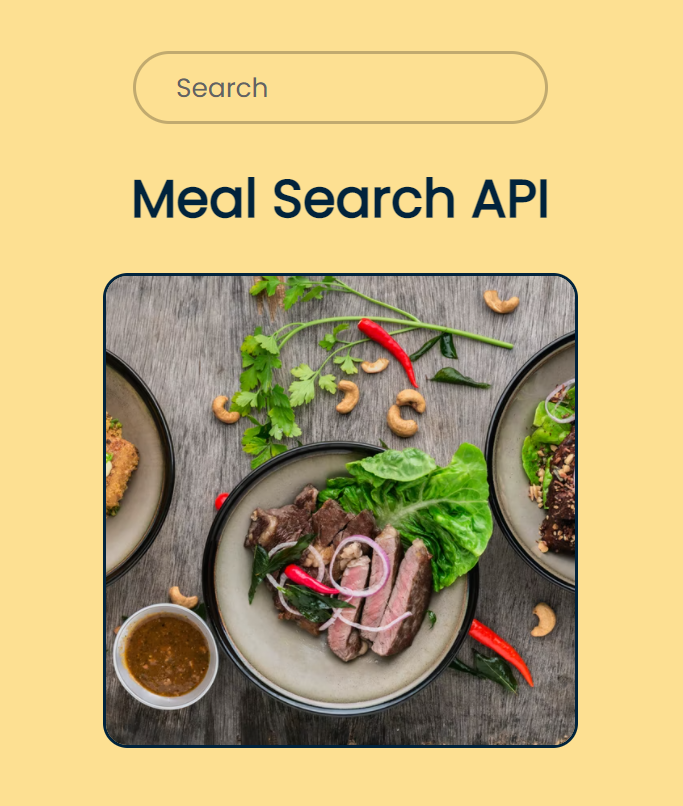

# meal-UI-API

> A UI that consumes the MealDB API and presents the user with an image of the meal, ingredients and instructions of how to make it.

## Table of contents

- [General info](#general-info)
- [Screenshots](#screenshots)
- [Technologies](#technologies)
- [Setup](#setup)
- [Features](#features)
- [Status](#status)
- [Inspiration](#inspiration)
- [Contact](#contact)

## General info

A meal search UI that consumes an API then presents the information back to the user.

## Screenshots

## Technologies

- HTML
- CSS
- JavaScript

## Setup

Open the index.html with any modern browser.

## Features

- Search function
- Display relevant image and information
- Error handling and search reset
- Responsive

## Status

Project is: _finished_

## Inspiration

Thank you to https://www.themealdb.com/ for allowing the use of their API for educational purposes.

## Contact

Created by [@scottybillsb](billsboroughscott@gmail.com) - feel free to contact me.
